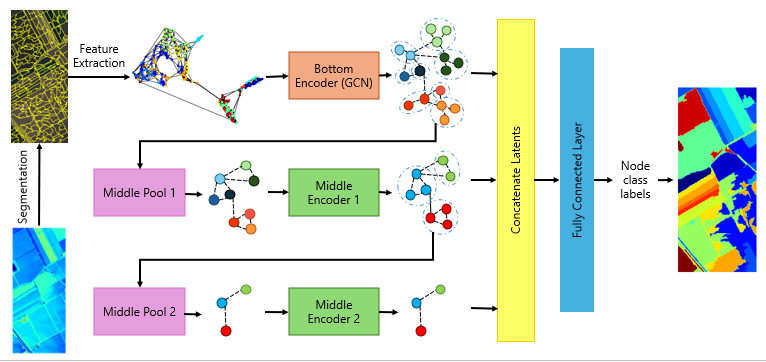

# MOB-GCN: Multiscale Object-Based Graph Neural Network for Hyperspectral Image Segmentation and Glassification



# Contributors:
* Yang Tuan Anh
* Phuong Dao
* Hy Truong Son (Correspondent / PI)

# Data
We use six benchmark HSI datasets to evaluate our approach, which have the following characteristics. INDIAN, SALINAS, PAVIA, BOTSWANA, KENNEDY can be found at [Hyperspectral Remote Sensing Scenes](https://www.ehu.eus/ccwintco/index.php/Hyperspectral_Remote_Sensing_Scenes) and TORONT (UT-HSI-301) can be found at [University of Toronto HSI-301 Dataset](http://vclab.science.uoit.ca/datasets/ut-hsi301/).
# Code
## Requirements

Create virtual environment
```bash
py -m venv .venv
.venv\Scripts\activate
```

Installing modules
```bash
pip install -r requirements.txt
```

##  Run

Load Experiments with Training (GCN)
```bash
py experiment_gcn.py --dataset INDIAN --segmentation_size 10 --training
```

Load Experiments without Training, assuming trained before (GCN)
```bash
py experiment_gcn.py --dataset INDIAN --segmentation_size 10
```

Inference (GCN)
```bash
py inference_gcn.py ---dataset INDIAN --segmentation_size 10 --weights_path output/INDIAN/experiment/gcn_model.pth --output_path output/INDIAN
```

Load Experiments with Training (MOB-GCN)
```bash
py experiment_mgn.py --dataset INDIAN --segmentation_size 10 --training
```

Load Experiments without Training, assuming trained before (MOB-GCN)
```bash
py experiment_mgn.py --dataset INDIAN --segmentation_size 10
```

Find optimal scales for MOB-GCN inference
```bash
py optimal_scale.py --dataset INDIAN --segmentation_size 10
```

Inference (MOB-GCN)
```bash
py inference_mgn.py ---dataset INDIAN --segmentation_size 10 --weights_path output/INDIAN/experiment/gcn_model.pth --output_path output/INDIAN --num_clusters 33,28,22,13,4
```

Benchmarking GCN, MOB-GCN (with `num_classes`) and MOB-GCN (with optimal scales)
```bash
py benchmark.py --dataset INDIAN --segmentation_size 10 --sample_size 0.05 --num_clusters 33,28,22,13,4
```

# Citation